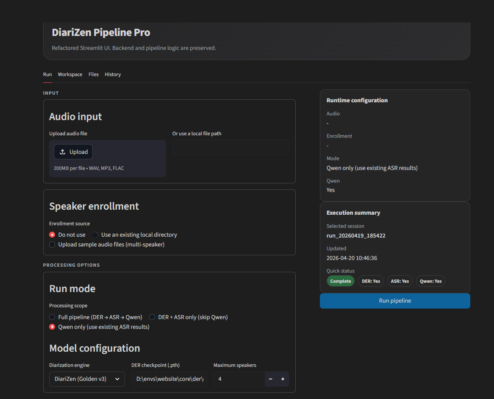

# ViMeet — Vietnamese Multi-Speaker Transcription System

> **Deep Learning Framework for Automatic Meeting Transcription in Noisy Environments**
> End-to-end pipeline: Speaker Diarization → ASR → Structured Transcript

[](https://www.python.org/)
[](https://streamlit.io/)
[](https://pytorch.org/)
[](LICENSE)

---

## Overview

**ViMeet** is an automatic Vietnamese meeting transcription system, developed as a final capstone project in AI/Deep Learning. The system addresses the **multi-speaker transcription** problem under real-world conditions — background noise, overlapping speech, and multiple simultaneous speakers.

- **Input**: Meeting audio file (`.wav`) with multiple speakers and background noise
- **Output**: Structured transcript — *who said what, and when*

### Main Pipeline

```
Audio Input
 |
 v
[Preprocessing]        Normalize to mono 16kHz
 |
 v
[Speaker Diarization]  DiariZen (WavLM-Large) + Enrollment Embeddings
 |
 v  RTTM file (who spoke when)
 |
 v
[ASR per Segment]      PhoWhisper-Large (Vietnamese)
 |
 v
[Post-processing]      Merge, align, format
 |
 v
Structured Transcript (JSON / TXT / CSV)
```

---

## Repository Structure

```
vimeet/
├── app_streamlit.py            Main Streamlit UI — entry point
├── pipeline_config.py          Global config: paths, model defaults
│
├── core/                       Core ML inference engines
│   ├── asr/
│   │   ├── engine.py           PhoWhisper ASR inference
│   │   ├── config.py           ASR hyperparameters & constants
│   │   ├── manifest_builder.py RTTM to JSONL manifest conversion
│   │   └── checkpoints/        Fine-tuned ASR model weights (not tracked)
│   │       └── best_adapter/
│   ├── der/
│   │   ├── engine.py           DiariZen diarization inference
│   │   ├── pyannote_engine.py  PyAnnote baseline engine
│   │   └── checkpoints/        Fine-tuned DER model weights (not tracked)
│   └── qwen/
│       └── engine.py           Qwen 2.5 transcript normalization & summary
│
├── ui/                         Streamlit UI components
│   ├── theme.py                CSS theme & i18n translator
│   ├── components.py           Reusable UI widgets
│   ├── transcript_view.py      Speaker-tagged transcript display
│   ├── summary_view.py         ASR workspace & result viewer
│   └── run_history.py          Run history management
│
├── audio_preprocess_input.py   Audio normalization utilities
├── asr_infer_bridge.py         Bridge: UI to ASR subprocess
├── der_infer_bridge.py         Bridge: UI to DER subprocess
├── qwen_infer_bridge.py        Bridge: UI to Qwen subprocess
├── asr_runner.py               ASR orchestration runner
│
├── output/                     Generated results (gitignored)
│   ├── der/                    RTTM diarization outputs
│   ├── asr/                    Transcript CSV/text outputs
│   └── qwen/                   Qwen summary outputs
│
├── debug/                      Dev/evaluation scripts
│   ├── asr_test/               ASR test manifests
│   └── scratch/                Experimental evaluation scripts
│
├── _ARCHIVES/                  Legacy scripts (version history)
│   └── qwen_scripts_legacy/    Qwen pipeline iteration history (v2-v8)
│
├── requirements_extra_web.txt  Additional UI dependencies
├── run_streamlit.ps1           Windows launch script
└── install_extra_web.ps1       Windows installation script
```

---

## Key Features

| Feature | Detail |
|---|---|
| Speaker Diarization | DiariZen (WavLM-Large), fine-tuned + enrollment-based speaker ID |
| Vietnamese ASR | PhoWhisper-Large, segment-level inference from RTTM |
| Speaker Attribution | Enrollment directory → identity-aware diarization |
| Structured Output | Timeline JSON, speaker-tagged transcript, RTTM artifacts |
| Web Interface | Streamlit UI with demo and debug mode |
| Low-VRAM Support | Qwen 4-bit quantization for RTX 4060 (8GB VRAM) |
| Run History | Save and review previous processing runs |

---

## Quick Start

### Requirements

- Python 3.10
- CUDA GPU (tested: RTX 3090 Ti for training, RTX 4060 8GB for inference)
- Windows 11 (PowerShell scripts included)

### Installation

```bash
# 1. Clone repository
git clone https://github.com/NewLeaner000/Vietnamese-Multi-Speaker-Transcription-System.git
cd Vietnamese-Multi-Speaker-Transcription-System

# 2. Create virtual environment
python -m venv .venv
.venv\Scripts\activate

# 3. Install PyTorch (match your CUDA version)
pip install torch torchaudio --index-url https://download.pytorch.org/whl/cu121

# 4. Install project dependencies
pip install -r requirements.txt
```

### Run

```bash
streamlit run app_streamlit.py
```

Or use the Windows script:

```powershell
.\run_streamlit.ps1
```

---

## Interface



The Streamlit interface orchestrates the full pipeline: audio upload, diarization configuration, ASR mode selection, real-time progress monitoring, and structured transcript output with run history.

---

## Model Checkpoints

### Fine-tuned Checkpoints (download required)

These checkpoints are not stored in the repository due to file size. Download and place them at the correct paths before running.

| Component | Path | Download |
|---|---|---|
| DER checkpoint (DiariZen fine-tuned) | `core/der/checkpoints/best_model.pth` | [Google Drive](https://drive.google.com/drive/folders/1pjW941P41BSZlNZcP9fkC1-t1TEVFptG?usp=sharing) |
| ASR checkpoint (PhoWhisper adapter) | `core/asr/checkpoints/best_adapter/` | [Google Drive](https://drive.google.com/drive/folders/1pjW941P41BSZlNZcP9fkC1-t1TEVFptG?usp=sharing) |

> After downloading, extract if needed and place files at the paths above before running.

### Qwen 2.5 (auto-downloaded from HuggingFace)

The Qwen models are **not included as custom checkpoints** — they are loaded directly from HuggingFace Hub at runtime. No manual download is required; the system pulls them automatically on first use.

| Model | HuggingFace ID | Usage |
|---|---|---|
| Qwen 2.5 1.5B Instruct (4-bit) | `Qwen/Qwen2.5-1.5B-Instruct` | Transcript normalization, fast summary |
| Qwen 2.5 7B Instruct (4-bit) | `Qwen/Qwen2.5-7B-Instruct` | Deep meeting summary |

> 4-bit quantization is applied automatically at runtime to reduce VRAM usage, enabling inference on RTX 4060 (8GB).

---

## Models Used

### Speaker Diarization

| Model | Role |
|---|---|
| `BUT-FIT/diarizen-wavlm-large-s80-md` | Backbone diarization — WavLM-Large based |
| Fine-tuned checkpoint (`.pth`) | Custom-trained on Vietnamese meeting data |
| Enrollment embeddings | Speaker identity matching from voice samples |

### Automatic Speech Recognition

| Model | Role |
|---|---|
| `vinai/PhoWhisper-large` | Vietnamese ASR — primary model |
| DiCoW | Alternative ASR backbone (benchmark) |

### Post-processing / Summary

| Model | Role |
|---|---|
| `Qwen/Qwen2.5-1.5B-Instruct` (4-bit) | Transcript normalization, fast summary |
| `Qwen/Qwen2.5-7B-Instruct` (4-bit) | Deep meeting summary |

---

## Usage Guide

### 1. Upload Audio

Select a `.wav` file (mono or stereo, any sample rate).

### 2. Configure Pipeline

**Diarization settings:**
- `DER Checkpoint` — path to fine-tuned `.pth` checkpoint (or use base model)
- `Enrollment directory` — folder containing voice samples for each known speaker
- `Number of speakers` — estimated speaker count
- `Low threshold` — detection sensitivity (default: `0.25`)

**ASR settings:**
- Mode: `whisper_only` / `wer_v2` / `dicow_only`
- `ASR Checkpoint` — path to adapter weights

### 3. Run and Monitor

Pipeline runs in order: Preprocess → DER → RTTM → ASR → Transcript

### 4. View Results

```
[00:00 - 00:05]  Speaker_A:  Good morning everyone, today we will discuss...
[00:06 - 00:12]  Speaker_B:  Agreed, first let us review the previous results...
```

---

## Output Files

Each run generates files under `output/`:

| File | Description |
|---|---|
| `hyp_low025.rttm` | Final diarization output (RTTM format) |
| `raw_low025.rttm` | Raw diarization output (before post-processing) |
| `transcript.csv` | ASR output with timestamps and speaker labels |
| `transcript.json` | Structured transcript (JSON) |
| `summary.md` | Meeting summary (if Qwen is enabled) |

---

## Configuration

Customize default paths in `pipeline_config.py`:

```python
DER_SCRIPT_PATH = "core/der/engine.py"
ASR_SCRIPT_PATH = "asr_runner.py"
DER_CHECKPOINT_DEFAULT = "core/der/checkpoints/best_model.pth"
QWEN_NORMALIZE_MODEL_DEFAULT = "Qwen/Qwen2.5-1.5B-Instruct"
```

Or use environment variables:

```bash
export DER_SCRIPT_PATH=/custom/path/der_engine.py
export DER_CHECKPOINT=/path/to/checkpoint.pth
```

---

## Experiments and Results

### DiariZen on test_labeled Set (best fine-tuned model)

| Dataset | DER(%) | Miss(%) | FA(%) | Conf(%) | Ov.F1 | Pred.Seg | GT Seg | Baseline DER |
|---|---|---|---|---|---|---|---|---|
| chuyen_ho | 41.281 | 1.895 | 33.413 | 5.974 | 0.066 | 1042 | 632 | 59.164 |
| coi_moi | 60.186 | 6.084 | 41.661 | 12.441 | 0.128 | 1398 | 669 | 92.307 |
| dustin_1 | 26.412 | 3.958 | 16.018 | 6.436 | 0.106 | 1236 | 785 | 56.185 |
| vif_1 | 6.793 | 2.875 | 3.618 | 0.301 | 0.000 | 714 | 625 | 19.845 |
| vif_2 | 6.897 | 0.540 | 5.972 | 0.386 | 0.000 | 375 | 522 | 15.155 |

### Pyannote on test_labeled Set (best fine-tuned model)

| Dataset | DER(%) | Miss(%) | FA(%) | Conf(%) | Ov.F1 | Pred.Seg | GT Seg | Baseline DER |
|---|---|---|---|---|---|---|---|---|
| chuyen_ho | 32.742 | 3.891 | 26.218 | 2.633 | 0.090 | 713 | 632 | 50.801 |
| coi_moi | 51.042 | 6.231 | 40.364 | 4.448 | 0.095 | 1028 | 669 | 72.408 |
| dustin_1 | 24.516 | 3.404 | 17.706 | 3.405 | 0.070 | 879 | 785 | 44.078 |
| vif_1 | 6.617 | 0.468 | 5.795 | 0.355 | 0.000 | 423 | 625 | 18.248 |
| vif_2 | 7.521 | 0.132 | 7.072 | 0.317 | 0.000 | 318 | 522 | 13.404 |

### Comparison DiariZen vs Pyannote (Best Fine-tuned Model)

| Criterion | Advantage | DiariZen (Best FT) | Pyannote (Best FT) |
|---|---|---|---|
| DER: Synthetic Data (overall) | DiariZen | **13.793%** | 17.441% |
| Miss: Synthetic Data (overall) | DiariZen | **1.138%** | 4.279% |
| FA: Synthetic Data (overall) | Pyannote | 9.731% | **1.761%** |
| Confusion: Synthetic Data (overall) | DiariZen | **2.924%** | 11.401% |
| Overlap F1: Synthetic Data (overall) | Pyannote | 0.478 | **0.555** |
| Pred. Seg count: Synthetic Data | Pyannote | 385 | **377** |
| DER: 2 speakers | DiariZen | **9.438%** | 13.672% |
| DER: 3 speakers | Pyannote | 17.858% | **17.008%** |
| DER: 4 speakers | DiariZen | **14.084%** | 21.643% |
| Overlap F1: 4 speakers | DiariZen | **0.677** | 0.533 |
| Conf: ov0 / 0% noise | DiariZen | **0.490%** | 11.274% |
| FA: ov0 / 0% noise | Pyannote | 6.653% | **1.236%** |
| DER: ov0 / 23% noise | Pyannote | 15.368% | **10.486%** |
| Loss function | N/A | PIT multilabel BCE | Powerset cross-entropy |

**Test set**: Vietnamese meeting data (noisy, multi-speaker)
**Hardware**: NVIDIA RTX 3090 Ti (training), RTX 4060 8GB (inference)

---

## Development Notes

- **Single venv**: All components (DER, ASR, Qwen, UI) share one virtualenv
- **Hardware target**: RTX 4060 8GB (inference) / RTX 3090 Ti (training/dev)
- **Bridge pattern**: UI calls subprocess bridges (`*_infer_bridge.py`) → core engines
- **Debug mode**: Toggle in UI to view full subprocess logs and error traces

---

## References

- [DiariZen — BUT-FIT](https://huggingface.co/BUT-FIT/diarizen-wavlm-large-s80-md)
- [PhoWhisper — VinAI](https://huggingface.co/vinai/PhoWhisper-large)
- [WavLM Large](https://arxiv.org/abs/2110.13900)
- [Qwen 2.5 — Alibaba](https://huggingface.co/Qwen/Qwen2.5-1.5B-Instruct)
- [PyAnnote Audio](https://github.com/pyannote/pyannote-audio)

---

## Authors

**Capstone Project — AIP491-SP26AI91**

| Role | Name | Student ID |
|---|---|---|
| Leader | Tran Nguyen Quang Khang | SE183747 |
| Member | Nguyen Duy Phuong | SE183477 |
| Member | Truong Minh Sang | SE184204 |
| Member | Ho Khanh Duy | SE184539 |

**Supervisors:** Huynh Van Thong — Nguyen Hong Hai

---

*This project was developed as an academic research prototype and is not intended for commercial use.*