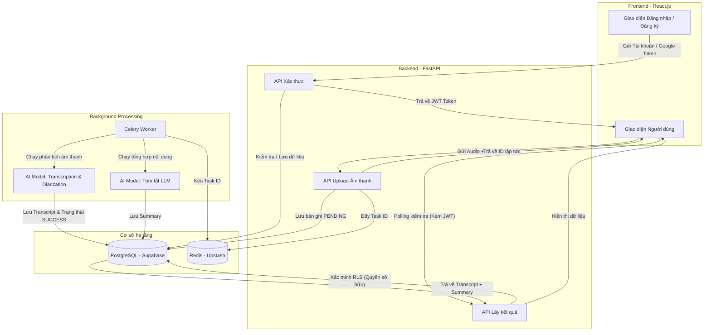

<div align="center">
  <h1>Vimeet - Hệ Thống Bóc Băng & Tóm Tắt Cuộc Họp Bằng AI</h1>
  <p><i>Xử lý âm thanh đa diễn giả, độ chính xác cao, bảo mật tuyệt đối.</i></p>
</div>

---

## Giai đoạn 1: Giới thiệu
**Vimeet** (Vietnamese Meeting) là một giải pháp toàn diện giúp doanh nghiệp và cá nhân tự động hóa việc "bóc băng" (transcription) các cuộc họp dài. Hệ thống có khả năng nhận diện nhiều giọng nói khác nhau (Speaker Diarization), chuyển đổi giọng nói thành văn bản với độ chính xác cao, và sử dụng AI để tóm tắt các ý chính, đưa ra Action Items (hành động cần làm).

Dự án được thiết kế với kiến trúc hệ thống hiện đại, áp dụng Message Queue (Celery + Redis) để xử lý các tác vụ nền (Background Processing) nặng về âm thanh, đảm bảo máy chủ API không bị thắt cổ chai và trải nghiệm người dùng luôn mượt mà.

---

## Trải nghiệm Trực tiếp (Live Demo)
Bạn có thể truy cập hệ thống đang được triển khai thực tế tại:
- **Đường dẫn:** [https://vietnamese-multi-speaker-transcript.vercel.app](https://vietnamese-multi-speaker-transcript.vercel.app)
- **Tài khoản dùng thử (Demo Account):** 
  - Username: `demouser`
  - Password: `123`

---

## Tính năng nổi bật
- **Hệ thống Xác thực Chuẩn mực:** 
  - Đăng nhập/Đăng ký qua JWT Token.
  - Tích hợp gửi mã OTP qua Email (Brevo API).
  - Tích hợp Google OAuth 2.0 (One Tap) đăng nhập siêu tốc.
  - Tích hợp các lớp phòng thủ: Chống Brute-force, Rate Limiting, Token Blacklisting.
- **Xử lý Âm thanh Đa diễn giả:** Phân biệt được ai đang nói câu gì trong cuộc họp.
- **Tóm tắt Thông minh:** Ứng dụng LLM để tóm tắt cuộc họp, trích xuất các quyết định và phân công công việc tự động.
- **Kiến trúc Bất đồng bộ (Asynchronous):** Người dùng có thể upload file và rời đi. Hệ thống tự xử lý ngầm dưới nền.
- **Bảo mật Dữ liệu (Row Level Security):** Mỗi người dùng chỉ được phép truy cập vào dữ liệu cuộc họp của chính mình. Phân quyền truy cập tài nguyên (IDOR Prevention) được cấu hình chặt chẽ.

---

## Công nghệ sử dụng (Tech Stack)

### Frontend (Client-side)
- Framework: React.js + Vite.
- Styling: Vanilla CSS (Sử dụng CSS Variables để làm giao diện Dark Mode / Glassmorphism).
- Authentication: @react-oauth/google.
- Deployment: Vercel.

### Backend (Server-side)
- Framework: FastAPI (Python) - Chuẩn ASGI tốc độ cao.
- Database ORM: SQLModel (kết hợp SQLAlchemy và Pydantic).
- Database Engine: PostgreSQL (Host trên Supabase).
- Message Broker & Caching: Redis (Host trên Upstash).
- Background Worker: Celery (Đảm nhiệm hàng đợi xử lý âm thanh).
- Deployment: Render.

---

## Luồng hoạt động hệ thống (System Flow)

Dưới đây là sơ đồ khối luồng xử lý (Flowchart). Bạn có thể copy mã Mermaid dưới đây và dán vào phần "Insert -> Advanced -> Mermaid" của công cụ **Draw.io** để tự động tạo sơ đồ chuyên nghiệp.



---

## Kiến trúc Bảo mật (Security Implementations)
- Mật khẩu: Băm một chiều bằng thuật toán bcrypt. Không lưu bản rõ (plaintext).
- Phân mảnh tài khoản: Hệ thống chuẩn hóa (lowercase, strip) mọi email đầu vào để chống tạo 2 tài khoản trùng lặp do phân biệt hoa/thường.
- Chống IDOR (Insecure Direct Object Reference): File âm thanh gốc được giấu kín khỏi thư mục public và chỉ cấp quyền tải về thông qua API riêng có gắn JWT Header.
- Anti Brute-force & DoS: 
  - Khóa tài khoản 15 phút nếu nhập sai OTP 5 lần (áp dụng ở Đăng ký & Quên mật khẩu).
  - Rate limit giới hạn thời gian (Cooldown 60 giây) giữa 2 lần bấm nút gửi Email OTP.
  - Sử dụng Token Blacklist lưu trên Redis để vô hiệu hóa hoàn toàn Access Token ngay khi người dùng Đăng xuất.

---

## Hướng dẫn chạy môi trường Local (Local Setup)

### 1. Chuẩn bị môi trường
Yêu cầu hệ thống đã cài đặt: Python 3.10+, Node.js 18+, và chuẩn bị API Key của Supabase (Postgres), Upstash (Redis), Brevo (Email).

### 2. Cài đặt Backend
```bash
cd backend
python -m venv venv
source venv/Scripts/activate

pip install -r requirements.txt

# Cấu hình .env
# Chạy script reset database
python reset_db.py

# Khởi chạy Server FastAPI
uvicorn app.main:app --reload

# Khởi chạy Celery Worker
celery -A app.worker.celery_app worker --loglevel=info --pool=solo
```

### 3. Cài đặt Frontend
```bash
cd frontend
npm install
npm run dev
```
Truy cập ứng dụng tại: `http://localhost:5173`.

---
*Dự án này là minh chứng rõ nét cho khả năng xây dựng kiến trúc hệ thống Microservices thu nhỏ, khả năng quản lý hàng đợi tác vụ nặng và kỹ năng giải quyết triệt để các vấn đề bảo mật phổ biến trong một ứng dụng Web Full-stack hiện đại.*
