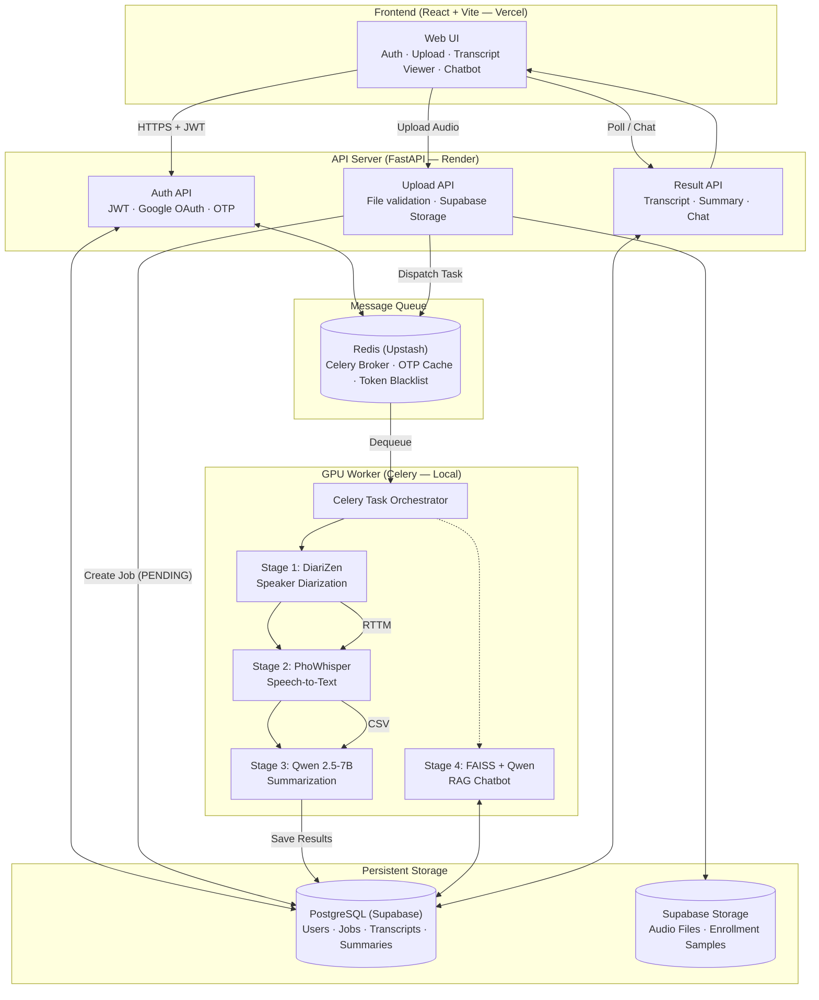

<div align="center">
  <h1>Vimeet</h1>
  <h3>Vietnamese Multi-Speaker Meeting Transcription & Summarization System</h3>
  <p><i>End-to-end AI pipeline — Speaker Diarization, ASR, LLM Summarization, and RAG-powered Chatbot</i></p>

  <br/>

  <a href="https://vietnamese-multi-speaker-transcript.vercel.app">Live Demo</a> · Demo Account: <code>demouser</code> / <code>123</code>
</div>

---

## Overview

**Vimeet** is a production-grade system that transforms raw audio recordings of Vietnamese meetings into structured, searchable transcripts with AI-generated summaries. It solves a critical enterprise pain point: manually transcribing multi-speaker meetings is slow, expensive, and error-prone.

The system chains four on-device AI models into a single automated pipeline:

| Stage | Model | Purpose |
|-------|-------|---------|
| 1. Diarization | DiariZen (WavLM-Large) | Identify *who* is speaking and *when* |
| 2. ASR | PhoWhisper (CTranslate2) | Convert speech segments to Vietnamese text |
| 3. Summarization | Qwen 2.5-7B (GGUF/llama.cpp) | Generate structured meeting minutes |
| 4. Chatbot | Qwen 2.5-7B + FAISS RAG | Answer questions about the transcript |

All inference runs locally on a single NVIDIA GPU (tested on RTX 4060 8GB). No cloud AI APIs are required for the core pipeline.

---

## System Architecture



---

## AI Pipeline — Detailed Flow

This is the core engineering work. Each stage is a separate Python module under `backend/app/ai_core/`, orchestrated by a Celery task.

```mermaid
flowchart LR
    subgraph INPUT ["Input"]
        Audio["Raw Audio<br/>(any format)"]
        Enroll["Enrollment Samples<br/>(optional)"]
    end

    subgraph PREPROCESS ["Stage 0 — Preprocessing"]
        Download["Download from<br/>Supabase Storage"]
        Normalize["FFmpeg Normalize<br/>→ 16kHz Mono WAV"]
    end

    subgraph DER ["Stage 1 — Speaker Diarization"]
        DiariZen["DiariZen<br/>(WavLM-Large backbone)<br/>Speaker segmentation +<br/>Agglomerative clustering"]
        RTTM["Output: RTTM file<br/>(who spoke when)"]
    end

    subgraph ASR ["Stage 2 — Speech Recognition"]
        Segment["Segment audio<br/>by RTTM timestamps"]
        Whisper["PhoWhisper<br/>(CTranslate2 INT8)<br/>Vietnamese ASR"]
        CSV["Output: CSV<br/>(speaker, start, end, text)"]
    end

    subgraph LLM ["Stage 3 — Summarization"]
        Filter["Hallucination filter<br/>+ Deduplication"]
        Qwen["Qwen 2.5-7B-Instruct<br/>(GGUF Q4_K_M via llama.cpp)<br/>GPU-accelerated"]
        Summary["Output: Structured summary<br/>(overview, decisions, action items)"]
    end

    subgraph RAG ["Stage 4 — Chatbot (on-demand)"]
        Embed["Embedding<br/>(Gemini API or<br/>Local MiniLM-L12)"]
        FAISS["FAISS Vector Index"]
        Retrieve["Speaker-aware<br/>Retrieval"]
        Answer["Qwen 2.5-7B<br/>Generate Answer"]
    end

    Audio --> Download --> Normalize
    Enroll --> Download
    Normalize --> DiariZen --> RTTM
    RTTM --> Segment --> Whisper --> CSV
    CSV --> Filter --> Qwen --> Summary
    CSV -.-> Embed --> FAISS --> Retrieve --> Answer
```



### Stage 0 — Audio Preprocessing
- Downloads audio from Supabase cloud storage to local worker
- Converts any input format to 16kHz mono WAV using FFmpeg/soundfile
- If enrollment samples are provided, each sample is also normalized for speaker verification

### Stage 1 — Speaker Diarization (DiariZen)
- **Model**: `BUT-FIT/diarizen-wavlm-large-s80-md-v2` — state-of-the-art neural diarization
- **Process**: WavLM extracts frame-level embeddings → DiariZen predicts speaker activity → Agglomerative clustering assigns speaker IDs
- **Enrollment support**: When voice samples are provided, the system matches detected speakers to known identities
- **Output**: RTTM file mapping each time segment to a speaker label

### Stage 2 — Automatic Speech Recognition (PhoWhisper)
- **Model**: Fine-tuned PhoWhisper, quantized to INT8 via CTranslate2 for 3x inference speedup
- **Process**: Audio is sliced according to RTTM timestamps → each segment is decoded independently → results are merged into a single CSV with columns `(speaker, start, end, predicted_text)`
- **Optimizations**: Retry logic for short/noisy segments, probability-based filtering, hallucination detection

### Stage 3 — Meeting Summarization (Qwen 2.5)
- **Model**: `Qwen2.5-7B-Instruct-Q4_K_M.gguf` running on llama.cpp with full GPU offload
- **Pre-processing**: ASR output is filtered for hallucinated text (known Vietnamese ASR artifacts), deduplicated by time-overlap + text similarity
- **Prompt engineering**: Structured prompt forces Markdown output with sections: Overview, Key Decisions, Action Items (with assignee names bolded)

### Stage 4 — RAG Chatbot
- **Architecture**: Retrieval-Augmented Generation using LangChain + FAISS
- **Embedding**: Dual backend — Gemini API (cloud) or `paraphrase-multilingual-MiniLM-L12-v2` (local)
- **Speaker-aware retrieval**: Detects speaker names in questions → filters FAISS results by speaker metadata → provides targeted context
- **Conversation memory**: Last 6 messages maintained in chat history for context continuity

---

## Model Fine-Tuning & Evaluation (Diarization)

To adapt the diarization model to the specific acoustic conditions of noisy Vietnamese meetings, we performed extensive fine-tuning on the **DiariZen** (`BUT-FIT/diarizen-wavlm-large-s80-md-v2`) base model.

### Fine-Tuning Strategy
- **Head Replacement:** The original powerset softmax classification head was replaced with a new linear layer followed by sigmoid activation, switching the output space to a per-speaker multilabel format (supporting up to 4 simultaneous speakers per chunk).
- **Loss Function:** Permutation Invariant Training (PIT) combined with multilabel Binary Cross-Entropy (BCE).
- **Gradual Unfreezing:** To prevent catastrophic forgetting of the robust WavLM Large backbone (316M parameters), a three-phase gradual unfreezing strategy was applied:
  - *Phase 1:* Unfreeze top 4 layers (anchor).
  - *Phase 2:* Unfreeze top 6 layers with data augmentation (overlap & noise).
  - *Phase 3:* Unfreeze top 6 layers for final consolidation.

### Diarization Accuracy Comparison (Baseline vs. Fine-Tuned)
The fine-tuning process yielded substantial improvements in Diarization Error Rate (DER) across both synthetic and real-world in-the-wild datasets. 

#### 1. Synthetic Data (Controlled Overlap & Noise)
| Metric | Baseline | Fine-Tuned (Best) | Improvement |
|--------|----------|-------------------|-------------|
| **Overall DER** | 30.10% | **13.79%** | **- 16.31%** |
| Missed Speech | 15.38% | **1.13%** | - 14.25% |
| Speaker Confusion | 6.79% | **2.92%** | - 3.87% |

*Note: The dramatic reduction in Missed Speech (-14.25%) ensures that downstream ASR receives complete audio segments without losing conversational content.*

#### 2. Real-world Self-Labeled Data (In-the-wild)
Evaluated on manually labeled YouTube Vietnamese talk shows and podcasts containing heavy background noise, music, and overlapping speech.

| Domain (Dataset) | Baseline DER | Fine-Tuned DER | Relative Error Reduction |
|------------------|--------------|----------------|--------------------------|
| Chuyen Ho (Podcast) | 50.80% | **32.74%** | 35.5% |
| Coi Mo (Conversation) | 72.40% | **51.04%** | 29.5% |
| Dustin (Vlog/Outdoor) | 44.07% | **24.51%** | 44.3% |
| VIF (News/Studio) | 18.24% | **6.61%** | 63.7% |
| **Average** | **46.37%** | **28.72%** | **38.0%** |

<br/>

## Model Fine-Tuning & Evaluation (ASR - PhoWhisper)

To enhance Vietnamese speech recognition under noisy conditions and resolve Whisper's inherent hallucination issues, we applied a specialized fine-tuning pipeline on the **PhoWhisper-large** (`vinai/PhoWhisper-large`) base model.

### Fine-Tuning Strategy
- **Partial Unfreezing (LoRA-inspired):** To avoid catastrophic forgetting and fit training within a single 24GB VRAM GPU, we froze the entire model except for the query (`q_proj`) and value (`v_proj`) projection matrices across all Attention modules. This reduced trainable parameters to just ~0.8%.
- **Two-Stage Curriculum Learning:**
  - *Stage 1 (Clean Adaptation):* Trained on high-quality, low-overlap (≤ 18%) audio to build a strong linguistic anchor. (Learning Rate: 1e-4)
  - *Stage 2 (Robustness Tuning):* Trained on heavy-noise and high-overlap (≤ 30%) audio to teach the model to make informed guesses under distortion. (Learning Rate: 2e-5)
- **Data Deduplication & Preprocessing:** Applied strict Unicode NFC normalization to prevent encoding mismatches, and a 2-pass deduplication (within-file and cross-file) to eliminate repeated audio chunks, which is the primary root cause of Whisper's infinite looping hallucinations.

### ASR Accuracy Comparison (Baseline vs. Fine-Tuned)
Evaluated on a diverse test set of 1,655 samples spanning 5 different acoustic domains (talk shows, vlogs, podcasts). Word Error Rate (WER) is decomposed into Substitutions (S), Deletions (D), and Insertions (I).

#### Overall WER & Hallucination Reduction
| Error Type | Base Model | Fine-Tuned (Stage 2) | Absolute Change |
|------------|------------|----------------------|-----------------|
| **Overall WER** | **18.72%** | **13.01%** | **- 5.71%** |
| Substitutions (S) | 7.50% | 5.69% | - 1.81% |
| Deletions (D) | 3.93% | 4.29% | + 0.36% |
| **Insertions (I)** | **7.29%** | **3.03%** | **- 4.26%** |

*Note: Insertions represent AI "hallucinations" (generating words not present in the audio). The fine-tuning strategy successfully reduced hallucinations by 58.5% (from 7.29% to 3.03%), significantly increasing the reliability of the transcript.*

#### Results by Acoustic Domain
| Domain (Dataset) | Base WER | Fine-Tuned WER | Relative Error Reduction |
|------------------|----------|----------------|--------------------------|
| VIF (News/Studio) | 14.97% | **6.48%** | 56.7% |
| Conan (Anime Dub) | 11.86% | **7.38%** | 37.8% |
| Dustin (Vlog/Outdoor) | 20.00% | **13.62%** | 31.9% |
| Chuyen Ho (Podcast) | 19.22% | **16.93%** | 11.9% |
| Coi Mo (Heavy Overlap) | 24.73% | **19.96%** | 19.3% |

---

## Security Architecture

```mermaid
flowchart LR
    subgraph AUTH ["Authentication Layer"]
        JWT["JWT Token<br/>(HS256, 7-day expiry)"]
        Google["Google OAuth 2.0<br/>(One Tap)"]
        OTP["Email OTP<br/>(Brevo API, 5-min TTL)"]
    end

    subgraph DEFENSE ["Defense Layer"]
        BF["Anti Brute-force<br/>Lock after 5 failed OTP attempts<br/>(15-min cooldown via Redis)"]
        RL["Rate Limiting<br/>60s cooldown between<br/>OTP send requests"]
        BL["Token Blacklist<br/>Immediate invalidation<br/>on logout (Redis)"]
        IDOR["IDOR Prevention<br/>Audio served via authenticated<br/>API endpoint, not public URL"]
        RLS["Row Level Security<br/>PostgreSQL RLS enforced<br/>on all tables"]
    end

    subgraph DATA ["Data Layer"]
        Hash["bcrypt Password Hashing<br/>(one-way, no plaintext)"]
        Email["Email Normalization<br/>(lowercase + strip)"]
        CORS["CORS Whitelist<br/>(localhost + production domains only)"]
    end

    AUTH --> DEFENSE --> DATA
```



| Threat | Mitigation | Implementation |
|--------|------------|----------------|
| Credential stuffing | bcrypt + rate limiting | `passlib[bcrypt]` + Redis cooldown |
| Session hijacking | Token blacklist on logout | Redis SET with TTL |
| IDOR (data leak) | Ownership verification on every query | SQL `WHERE user_id = current_user` |
| Email spoofing | Real-time MX record validation | `email-validator` library |
| Brute-force OTP | Account lockout after 5 attempts | Redis counter with 15-min expiry |

---

## Tech Stack

| Layer | Technology | Rationale |
|-------|-----------|-----------|
| **Frontend** | React 18 + Vite | Fast HMR, SPA with component architecture |
| **Styling** | Vanilla CSS + CSS Variables | Dark/Light theme, glassmorphism, responsive (mobile-first) |
| **i18n** | Custom `t()` function | Vietnamese / English toggle, zero external dependency |
| **API Server** | FastAPI (Python 3.10) | Async ASGI, automatic OpenAPI docs, type-safe with Pydantic |
| **ORM** | SQLModel | SQLAlchemy + Pydantic hybrid — single model for DB and API |
| **Database** | PostgreSQL (Supabase) | Row Level Security, managed hosting, real-time capabilities |
| **File Storage** | Supabase Storage | S3-compatible, integrated with PostgreSQL auth |
| **Message Queue** | Redis (Upstash) | Celery broker + OTP cache + token blacklist |
| **Task Queue** | Celery | Distributed task processing, progress tracking via `update_state` |
| **Diarization** | DiariZen + WavLM-Large | SOTA neural diarization with enrollment support |
| **ASR** | PhoWhisper + CTranslate2 | Vietnamese-optimized Whisper, INT8 quantized |
| **LLM** | Qwen 2.5-7B-Instruct (GGUF) | Local inference via llama.cpp, GPU-accelerated |
| **RAG** | LangChain + FAISS | Speaker-aware retrieval, dual embedding backend |
| **Deployment** | Vercel (FE) + Render (API) + Local GPU (Worker) | Hybrid cloud-edge architecture |

---

## Project Structure

```
vimeet/
├── frontend/                    # React SPA
│   ├── src/
│   │   ├── App.jsx              # Main application (1200+ lines)
│   │   ├── i18n.js              # Vietnamese/English dictionaries
│   │   ├── index.css            # Design system + responsive breakpoints
│   │   └── main.jsx             # React entry point
│   └── index.html
│
├── backend/                     # FastAPI + Celery
│   ├── app/
│   │   ├── api/
│   │   │   ├── auth.py          # Authentication endpoints (JWT, Google, OTP)
│   │   │   ├── upload.py        # Audio upload + job creation
│   │   │   └── summary.py       # Summary retrieval + chat API
│   │   ├── ai_core/
│   │   │   ├── asr/
│   │   │   │   └── engine.py    # PhoWhisper ASR engine (CTranslate2)
│   │   │   ├── der/
│   │   │   │   └── engine.py    # DiariZen diarization engine
│   │   │   ├── qwen/
│   │   │   │   └── engine.py    # Qwen summarization engine (llama.cpp)
│   │   │   ├── rag/
│   │   │   │   └── engine.py    # FAISS RAG chatbot engine
│   │   │   ├── asr_runner.py    # ASR orchestration bridge
│   │   │   ├── der_infer_bridge.py    # Diarization bridge
│   │   │   ├── qwen_infer_bridge.py   # Summarization bridge
│   │   │   └── pipeline_config.py     # Model paths + defaults
│   │   ├── core/
│   │   │   ├── security.py      # JWT, bcrypt, token blacklist
│   │   │   ├── storage.py       # Supabase file I/O
│   │   │   ├── email.py         # Brevo OTP sender
│   │   │   ├── cleanup.py       # Async trash cleanup loop
│   │   │   └── config.py        # Environment settings
│   │   ├── models/              # SQLModel ORM (User, Job, Transcript, Summary)
│   │   ├── schemas/             # Pydantic request/response schemas
│   │   ├── worker/
│   │   │   ├── celery_app.py    # Celery configuration
│   │   │   ├── tasks.py         # Main transcription pipeline task
│   │   │   └── tasks_ai.py      # Summarization + chat tasks
│   │   └── main.py              # FastAPI app entry point
│   └── requirements.txt
│
└── requirements.txt             # AI/ML dependencies (PyTorch, etc.)
```

---

## Getting Started

### Prerequisites
- Python 3.10+, Node.js 18+, NVIDIA GPU (CUDA 12.1+)
- Accounts: Supabase (PostgreSQL + Storage), Upstash (Redis), Brevo (Email)

### Backend Setup
```bash
cd backend
python -m venv venv && source venv/Scripts/activate  # Windows
pip install -r requirements.txt

# Configure environment
cp .env.example .env  # Fill in Supabase, Redis, Brevo credentials

# Initialize database
python reset_db.py
python seed_demo.py  # Creates demo account

# Start API server
uvicorn app.main:app --reload --host 0.0.0.0 --port 8000

# Start Celery worker (separate terminal)
celery -A app.worker.celery_app worker --loglevel=info --pool=solo
```

### Frontend Setup
```bash
cd frontend
npm install
npm run dev  # Starts at http://localhost:5173
```

### AI Model Setup
```bash
# Install PyTorch with CUDA
pip install torch torchaudio --index-url https://download.pytorch.org/whl/cu121

# Install remaining ML dependencies
pip install -r requirements.txt  # Root requirements.txt

# Model checkpoints are auto-downloaded on first run:
#   DiariZen  → HuggingFace Hub
#   PhoWhisper → backend/app/ai_core/asr/checkpoints/
#   Qwen GGUF → backend/app/ai_core/qwen/checkpoints/
```

---

## Performance Benchmarks

Tested on a single NVIDIA RTX 4060 Laptop GPU (8GB VRAM):

| Metric | Value |
|--------|-------|
| Diarization (DiariZen) | ~60s for 10-min audio |
| ASR (PhoWhisper INT8) | ~70s for 10-min audio |
| Summarization (Qwen 2.5-7B Q4) | ~15s per summary |
| Total pipeline (10-min meeting) | ~2.5 minutes end-to-end |
| Peak VRAM usage | ~6.2 GB |
| Max supported audio length | 75 MB file size limit |

---

## Team & Contributors

This project was developed as an AI Capstone Project at FPT University (AIP491-SP26AI91).

**Group Members:**
- Tran Nguyen Quang Khang - SE183747
- Nguyen Duy Phuong - SE183477
- Truong Minh Sang - SE184204
- Ho Khanh Duy - SE184539

**Supervisors:**
- Huynh Van Thong (ThongHV4)
- Nguyen Hong Hai (HongNH51)

---

## License

This project is licensed under the [MIT License](LICENSE) - see the [LICENSE](file:///d:/website/LICENSE) file for details.